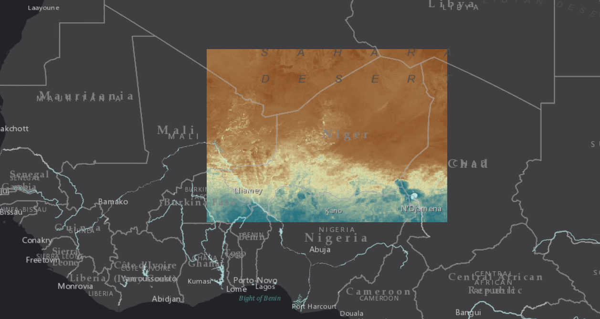

# IdrisiRaster-R
This repository contains a Windows executable, a series of Idrisi Raster image files, and an R script to automate the estimation of statistically significant temporal trends, average, 
and coefficient of variation on each pixel. The R code connects to the C language via command shell in order to pre-process the input raster imagery for R.

## Credits and Contacts

Francesco Tonini: <ftonini84@gmail.com>

Rogerio Bonifacio (World Food Program, Analysis and Trends Service, HQ): <rogerio.bonifacio@wfp.org>

## LICENSE

[Apache 2.0](LICENSE)
